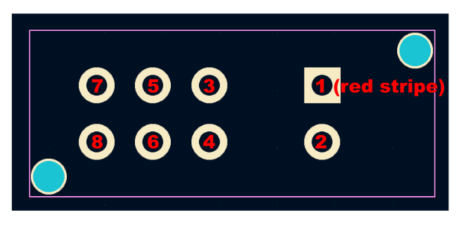
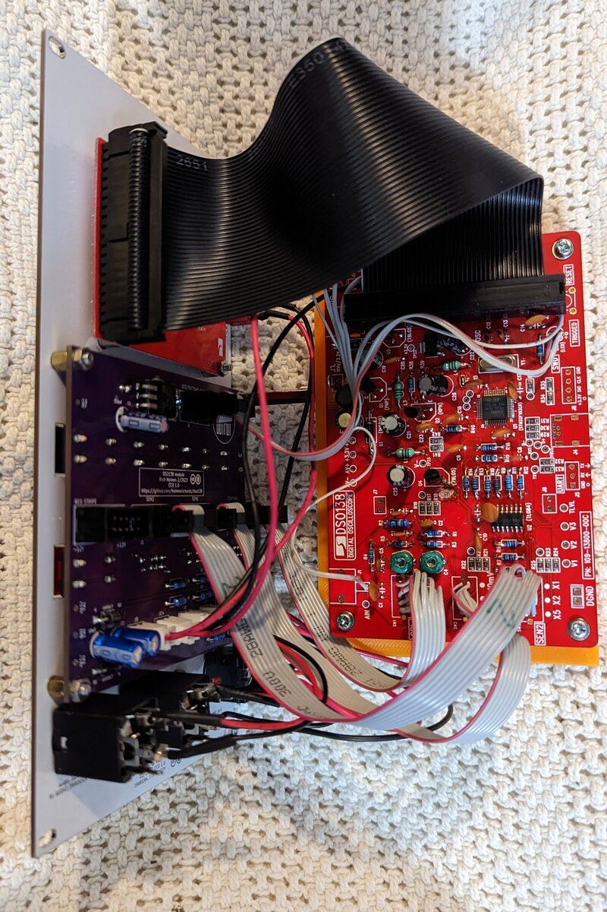
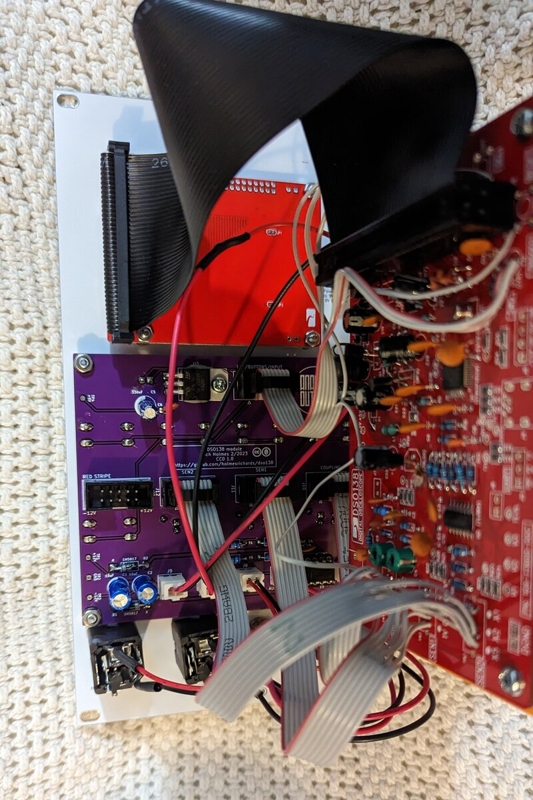
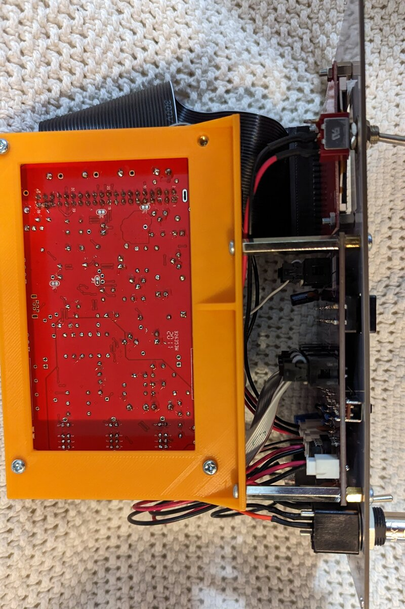

#DSO-138 module build notes

The PCB, panel, and mounting fixture in this repo are intended to be used with a DSO-138 scope kit. The kit should be assembled according to its instructions except to omit the following:

* 3 slide switches
* 5 tactile switches
* 1 indicator LED
* 1 BNC jack
* 1 DC barrel jack

Assemble the auxiliary PCB as usual. The regulator can be bent over and screwed to the PCB with a 6 mm M3 screw and nut. Note slide switches and tactile buttons go on the opposite side of the board from everything else. Leave the indicator LED unsoldered in its footprint for now.

Print the mounting fixture from the STL file provided, or use your ingenuity to make something equivalent.

Make four 8-conductor ribbon cables about 15 cm long, enough to reach from the auxiliary PCB to the main PCB (see assembly photos below) with an IDC connector at one end. Orient the connector like you would a Eurorack power cable so the red stripe corresponds to conductor 1, then the remaining conductors are 2 through 8. Separate the conductors and strip insulation at the other end. The conductors are soldered to the main PCB as follows:

3 cables are soldered to the slide switch footprints as shown:

The fourth cable's conductors go to various footprints:

* 1 to LED cathode
* 2 to LED anode (marked +)
* 3 to SW8 button (RESET), top left pad (closest to LED)
* 4 to SW7 button (SEL), bottom left pad
* 5 to SW6 button (-), bottom left pad
* 6 to SW5 button (+), bottom left pad
* 7 to input pad (either AIN or adjacent one on PNC footprint)
* 8 to SW4 button (OK), bottom left pad

Take a pair of wires with a micro JST XH2.54 connector on one end and solder the other ends to the DC power +9 V and Ground footprints on the main PCB. Take care with which wire goes to which point. The one that is on the right when plugged into the JST header on the auxiliary PCB should connect to ground.

The display LED PCB is connected to the main PCB using a 40 position ribbon cable with male IDC connector on one end and female on the other. Pay attention to the orientation; each pin should connect to the socket position it would have connected to if you had plugged the display board directly into the main one.

Assemble the module as follows:

Put 12 mm M3 screws in the holes in the lower half of the front panel. Put 5 mm M3 spacers on these screws behind the panel. Mount the auxiliary PCB on the screws with the JST headers at the bottom. Secure with two M3 nuts on the left side (viewed from behind the panel) and two 30 mm M3 spacers on the right. Make sure the LED is positioned in its hole, then solder it.

Put 12 mm M2.5 screws in the holes in the upper half of the front panel. Put 5 mm M2.5 spacers on these screws behind the panel. Mount the display PCB on the screws with the 40 pin header on the left side. Secure with four M2.5 nuts.

Attach the main PCB to the 3D printed fixture (or whatever equivalent you are using) with 6 mm M3 screws and 10 mm M3 spacers. Attach the fixture to the 30 mm spacers with 6 mm M3 screws. The (intended, as indicated by the silkscreen) top of the PCB should be toward the panel; the 40 pin socket should be near the (actual) top.

Plug the ribbon cables into the shrouded headers; refer to the silkscreen to determine which goes where.

Plug the JST connector connected to the power footprint into the header marked +9V/GND. Verify the wire on the right goes to ground on the main PCB.

Install jacks and toggle switches on the panel. The power toggle (next to the LED display) is mounted vertically and the input toggle is mounted horizontally.

Solder 4 more pairs of wires with JST connectors and plug them in as follows:

* Solder to center and bottom terminals of the power switch. These can go either way around. Plug in to header marked PWR SWITCH.
* Solder to signal and ground terminals of the THROUGH 1/4" jack. Plug in to header marked AUD THRU/GND. Ground must go to the header pin on the right.
* Solder to signal and ground terminals of the INPUT 1/4" jack. Plug in to header marked AUD IN/GND. Ground must go to the header pin on the right.
* Solder to center and right terminals of the INPUT switch. Plug in to header marked IN/AUD BUF. Right terminal must go to the header pin on the right.

Wire the center pin of the BNC jack to the left terminal of the INPUT switch. Wire the ground pin of the BNC jack to the ground pin of the INPUT 1/4" jack.

You're done! Assuming it works.

 

 

