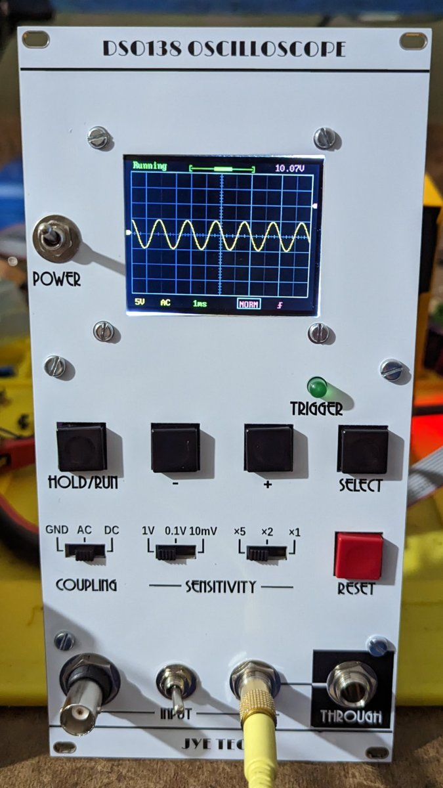

# DSO138 Oscilloscope

This is the JYE Tech DSO138 Oscilloscope put behind a 10 cm wide Kosmo format panel. 

Slide switches, tactile buttons, and trigger indicator LED are mounted to an auxiliary PCB mounted behind the panel. Also on this board are a Eurorack style 10-pin power header with 10 µF caps and power reversal diodes, and a 9 volt regulator and TL072 op amp with associated passive components.

A BNC jack and a 1/4" phone input jack are mounted on the front panel. A toggle switch selects whether the scope input is connected to the BNC or to the 1/4" jack signal after being buffered with the TL072. The latter signal, buffered, also goes to a second 1/4" panel mounted jack, so the signal can be passed on to another module.

Also on the front panel is another toggle switch, controlling the 9 V power. (It's good to power off the scope when not in use, for at least three reasons: the scope draws about 130 mA current on the +12 V rail, it probably puts out some digital noise you don't want getting into your synth sound, and leaving it powered off when not in use will help extend the life of the display.)

Connections to and from each slide switch are sent to the DSO138 switch footprints via an 8-conductor ribbon cable. A fourth ribbon cable connects the tactile buttons, both sides of the LED, and the input signal to the appropriate pads on the main board. Two more wires carry 9 V and ground to that board, which is mounted perpendicular to the front panel. I used a 3D printed carrier and long spacers to attach it.

The display PCB is mounted to the front panel and is connected to the main PCB via a 40 conductor ribbon cable.

## Current draw
130 mA +12 V, 10 mA -12 V


## Photos



## Documentation

* [Schematic (auxiliary board)](Docs/dso138.pdf)
* PCB layout: [front](Docs/dso138_layout_front.pdf), [back](Docs/dso138_layout_back.pdf)
* [BOM](Docs/dso138_bom.md)
* [Build notes](Docs/build.md)

## GitHub repository

* [https://github.com/holmesrichards/dso138](https://github.com/holmesrichards/dso138)

## Submodules

This repo uses submodules aoKicad and Kosmo_panel, which provide needed libaries for KiCad. To clone:

```
git clone git@github.com:holmesrichards/dso138.git
git submodule init
git submodule update
```


Alternatively do

```
git clone --recurse-submodules git@github.com:holmesrichards/dso138.git
```

Or if you download the repository as a zip file, you must also click on the "aoKicad" and "Kosmo\_panel" links on the GitHub page (they'll be in the Libraries folder and will have "@ something" after them) and download them as separate zip files which you can unzip into this repo's aoKicad and Kosmo\_panel directories (in the Libraries folder).

If desired, copy the files from aoKicad and Kosmo\_panel to wherever you prefer. 

Then in KiCad, go into Edit Symbols and add symbol libraries 

```
aoKicad/AO_symbols
Kosmo_panel/Kosmo
```
and go into Edit Footprints and add footprint libraries 
```
aoKicad/AO_tht
Kosmo_panel/Kosmo_panel.
```
